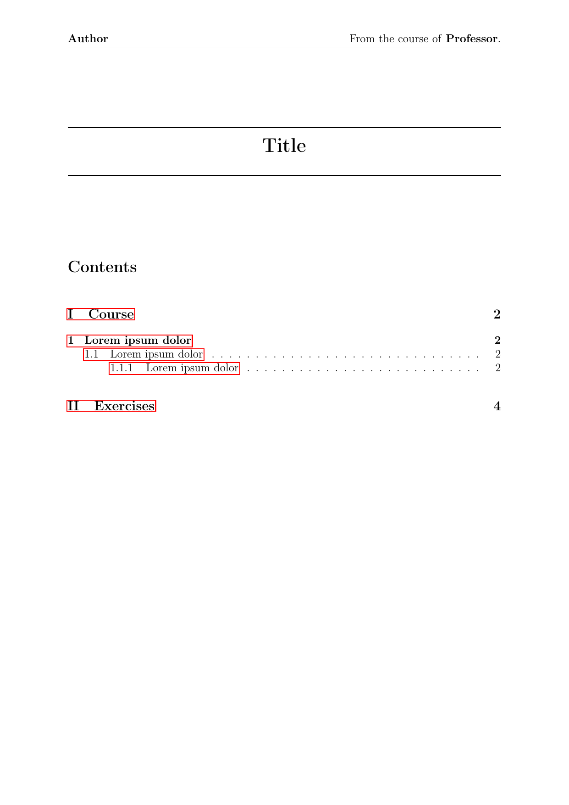
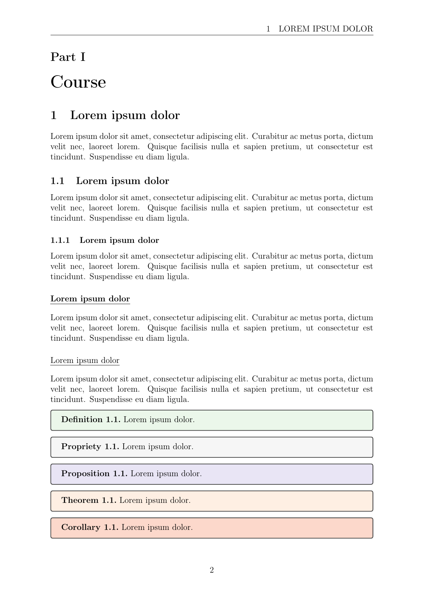
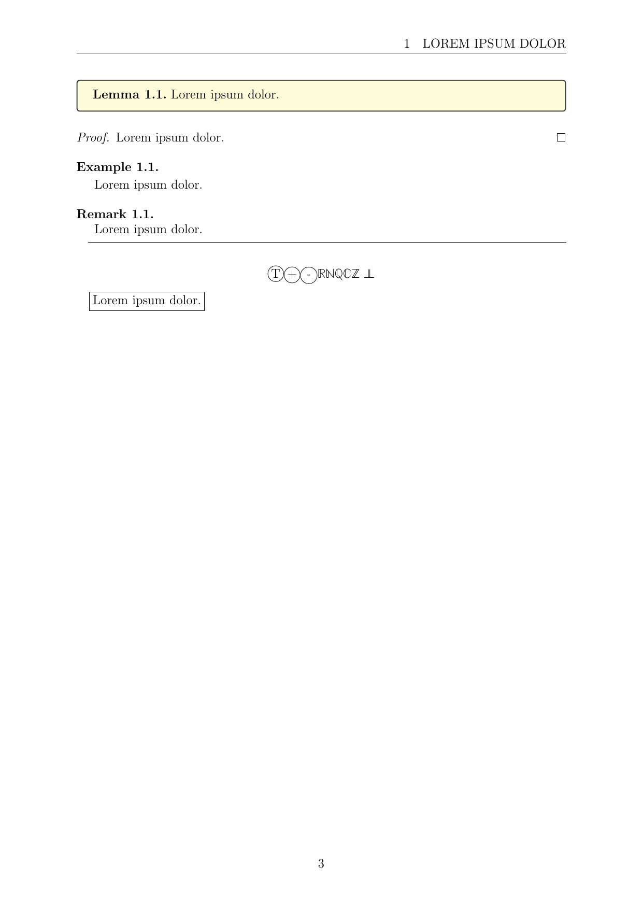
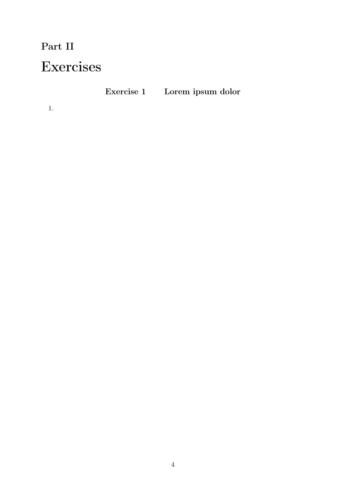

# latex-template

This is a LaTeX template intended to take notes in math classes. It is refined to my liking and is not intended to be a general purpose template. It is based on the [Math Notes Template](https://www.overleaf.com/latex/templates/math-notes-template/kfqdrzrzpvvk).

  
  

  
  

## Usage

* Write your course in the course.tex file.
* Write your exercises in the exercises.tex file.
* Configure the language (english and french are supported), title and author in the config.tex file.

Or just do whatever you want with it.